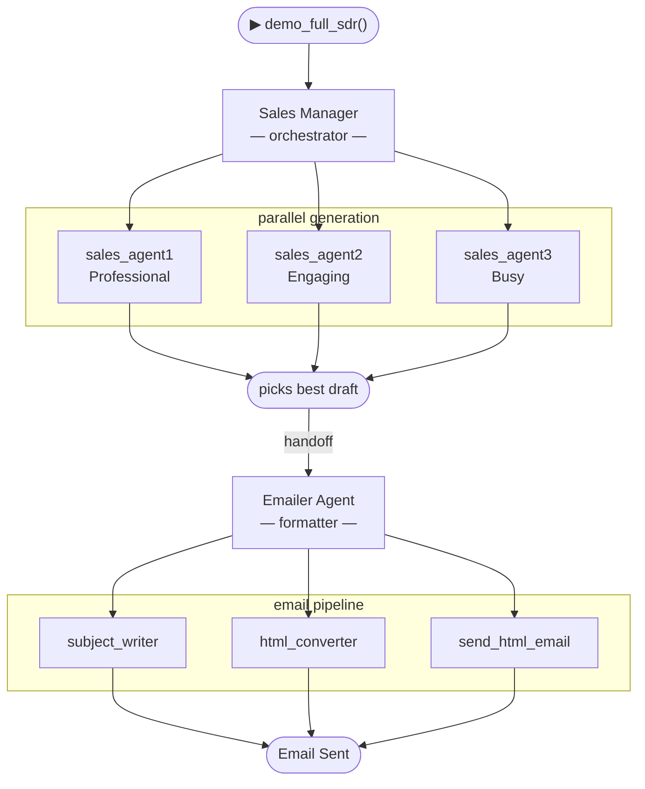

# SDR Agent — Full Pipeline Flow

```mermaid
flowchart TB

    main(["▶ demo_full_sdr()"])

    main --> mgr["Sales Manager\n― orchestrator ―"]

    subgraph parallel["parallel generation"]
        direction LR
        a1_4["sales_agent1\nProfessional"]
        a2_4["sales_agent2\nEngaging"]
        a3_4["sales_agent3\nBusy"]
    end

    mgr --> a1_4 & a2_4 & a3_4
    a1_4 & a2_4 & a3_4 --> best(["picks best draft"])

    best -->|handoff| emailer["Emailer Agent\n― formatter ―"]

    subgraph pipeline["email pipeline"]
        direction LR
        sw["subject_writer"]
        hc["html_converter"]
        she["send_html_email"]
    end

    emailer --> sw & hc & she
    sw & hc & she --> done(["Email Sent"])
```
